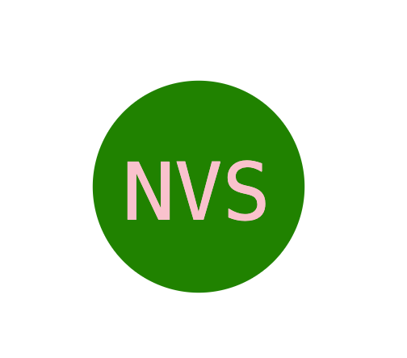

# Logo Maker
  

## Description
This application should be used for those who need to generate a simple logo for their business or personal purposes. You can customize the text in the logo, text color, shape, and shape color.

## Table of Contents 
- [Installation](#installation)
- [Usage](#usage)
- [Credits](#credits)
- [License](#license)
- [Contributing](#contributing)

## Installation
Once the application is open in VS Code, make sure to enter "npm i" in the terminal to install the npm packages that are in the package.json. Then, when you are in the correct directory in your terminal, run "node index.js" and then you will be prompted (in the terminal) to answer questions based on the type of logo you would like to create.

## Usage
You will be prompted to answer four questions about your logo in the terminal. Once you answer those questions, a logo.svg will be generated as a new file.

## License
  
  This application is covered under the MIT license.

## Contributing

what someone needs to know about takin gmy code and adding to it...

## Tests

in order to run tests.....npm run test

## Questions

My GitHub username is: nvanschaack. The link to my github profile is https://github.com/nvanschaack.
You can reach me with additional questions at nellvanschaack@gmail.com.
